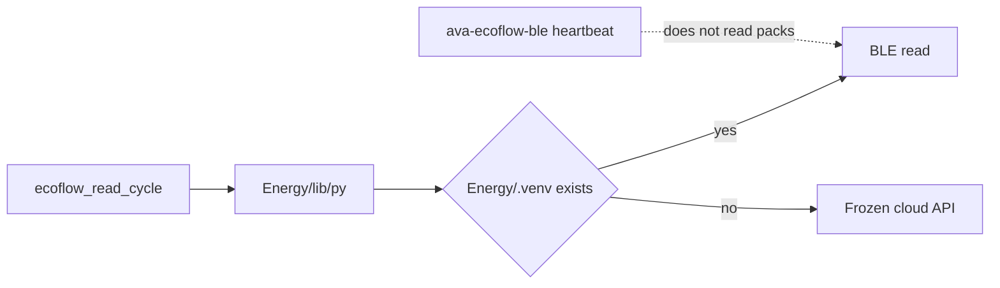

# Restore EcoFlow BLE, then continue the cutover

The previous pass kept re-reading work orders because the migration matrix has no remaining “just copy it” rows. This pass starts with the live regression, then only changes paths that are still running.

## What is actually stale

`ava-ecoflow-ble.service` is healthy and writing a heartbeat every 30 s. That process does not read the packs. Reads come from the poller job `ecoflow_read_cycle` → [leapfrog-read.sh](1 - Servers/1 - RootRecord-Pacific-Solar-Server/Energy/scripts/read/leapfrog-read.sh) → [lib/py](1 - Servers/1 - RootRecord-Pacific-Solar-Server/Energy/lib/py) → [read_runner.py](1 - Servers/1 - RootRecord-Pacific-Solar-Server/Energy/lib/read_runner.py).

Right now both packs are `source: api` with frozen numbers (Delta 2 stuck at 7% / 57 W AC, River 2 Pro stuck at 100% / 64 W). Last real Delta 2 BLE sample was **19:49 HST** (`soc=11.39%`). River 2 Pro had already fallen to the API earlier the same evening while Delta 2 was still on BLE, so those are two faults, not one.

`Energy/.venv` is missing again. [lib/py](1 - Servers/1 - RootRecord-Pacific-Solar-Server/Energy/lib/py) then uses system `python3`, `eflib`/`bleak` fail, and [read_runner.py](1 - Servers/1 - RootRecord-Pacific-Solar-Server/Energy/lib/read_runner.py) silently switches to the EcoFlow cloud API. That is the same failure recorded at 03:20 HST in [2026-09-29-ecoflow-stale-data-energy-venv.md](5 - RootRecord-Library/Documentation/07-testing/2026-09-29-ecoflow-stale-data-energy-venv.md). The venv is git-ignored, so a clean tree or a sync can drop it without a commit.

## Step 1 — put BLE samples back

- Recreate git-ignored `Energy/.venv` from the same pinned energy freeze used at 03:20 (G2 energy env). If that freeze file is gone, install `bleak` and `ecdsa` into a new venv and write a tracked `Energy/requirements.txt` so the next disappearance is a one-command rebuild.
- Run one Delta 2 read and one River 2 Pro read through `lib/py`. Pass is `source: ble` and a SOC that is not the frozen API number.
- Do not restart `ava-ecoflow-ble` unless the adapter is wedged. The owner is not the reader.
- If Delta 2 returns to BLE and River 2 Pro still fails the scan (`device not seen` for `DC:06:75:56:AC:1D`), record that separately. Do not invent a MAC and do not arm or switch any output.

## Step 2 — stop the silent fallback

In [read_runner.py](1 - Servers/1 - RootRecord-Pacific-Solar-Server/Energy/lib/read_runner.py), include the BLE failure reason on the line the poller already logs (`SUMMARY=… src=api`), so the next stall shows up in `Logs/Automations/automations_current.log` instead of looking like a healthy read.

## Step 3 — new layout is the live authority

Standing rule stays: do not delete or retire the old repos in this pass. “New layout takes priority” means anything still executing uses Ecosystem paths:

- Code and units: `1 - Servers/1 - RootRecord-Pacific-Solar-Server`
- Data and logs: `2 - RootRecord-Database`
- Docs and work orders: `5 - RootRecord-Library`

After BLE is green, check running units and the poller for leftover `/home/rootrecord/Database` or `~/.ollama/skills` executables. Repoint only what is still live. Leave historical evidence files and the kept G2 tree alone.

Do not reopen the 33 missing / 22 partial matrix rows. Those are blocked on speaker playback, Telegram or Discord sends, cloud spend, product repos, or deletes. Updating [WO-SRV](5 - RootRecord-Library/Documentation/06-development/Work-Orders/Servers_Cutover_Work_Order_WO-SRV-2026-09-27.md) is one short status line after the BLE recheck, not another survey.
